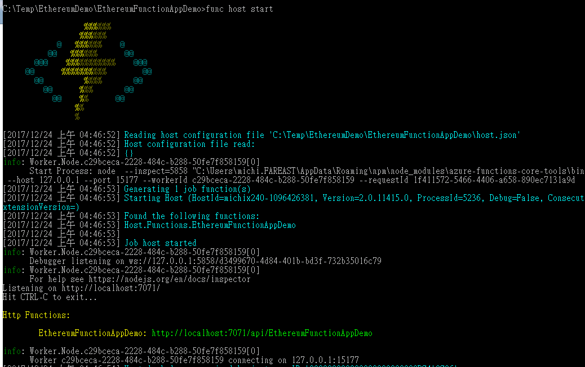
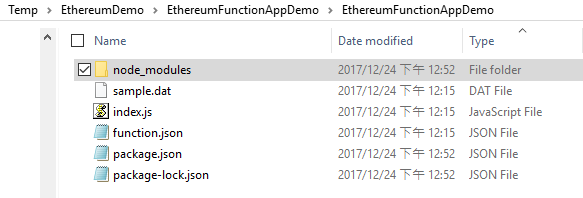
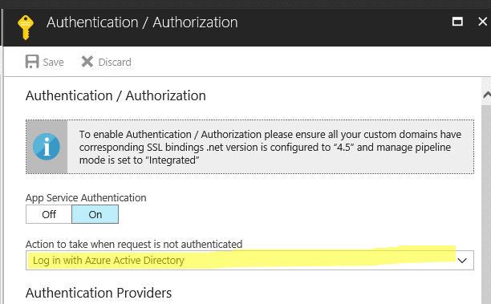

Integrate Function App with Ethereum
====================================

Abstract
--------

One of the challenges in adopting Blockchain technology in a consortium chain
environment is to have a stable, fast-deploy, easy management to deploy your
middleware services to integrate with Blockchain. The middleware environment has
to be able to not only leverage existing popular Blockchain library, but also
has to provide modern software tools for enterprises DevOps, testing needs.

In this document, we use Azure Function App to create a middleware layer that
leverages Web.Js to communicate with Ethereum consortium network. We will be
demonstrating how to setup Azure Function App integrated with continue
deployment features, as well as to demonstrate required steps to setup your
Function App as Ethereum consortium middleware for blockchain participants.

How to use
----------

We assume you have basic Azure experience, you have basic knowledge on how to
create Azure services as well as to have basic knowledge on how to manage them.

This document is focusing on how to create, deploy and test an Ethereum network
integrated middleware. We will not be covering how to create Ethereum network,
how to write smart contracts, how to deploy and test smart contracts in this
document. If you have interests in these topics, please refer to
[Solidity](http://solidity.readthedocs.io/en/develop/introduction-to-smart-contracts.html)
and [Ethereum official site.](https://www.ethereum.org/) We will be discussing
Azure Active Directory integration to authenticate callers in high-level,
however security aspect is not major concern in this document.

You must have a Github account in order to follow CD setup steps describe in
this document but it is not required. All source codes can be edit directly in
Azure Function App online code editor without CD enabled.

Table of Content
----------------
[Create Function App and Setup CD](#create-function-app-and-setup-cd)

[Setup Function App Local Test Environment and Github source control](#setup-function-app-local-test-environment-and-github-source-control)

[Write your Ethereum middleware](#write-your-ethereum-middleware)

[Deploy your middleware](#deploy-your-middleware)

[Enable Azure AD Authentication](#enable-azure-ad-authentication)

[Troubleshooting](#troubleshooting)

[Writing Client Application](#writing-client-application)

### Create Function App and Setup CD ###
--------------------------------

In this section, we will be introducing how to setup Azure Function App continue
deployment with Github repository. Please refers Microsoft official document
site for [Azure Function creation
steps](https://docs.microsoft.com/en-us/azure/azure-functions/functions-create-first-azure-function)
if required.

-   Login to your GitHub account, create a repository called
    EthereumFunctionAppDemo as our deployment source if you don’t have one yet..


-   Note down Git URL


-   Create an Azure Function App if you don’t have one.

    -   Choose JavaScript as programing language so that we can use
        [web3.js](https://github.com/ethereum/web3.js/) in our demo.

    -   You can choose either App Service Plan or Consumption plan, in this
        document we will be choosing App Service Plan with B1 pricing tier.

    -   In this document we use Windows as our underlying operation system.

-   Once created, go to your Function App’s Overview section.

-   Add a new JavaScript Http Trigger Function


-   Navigate to the newly created Function App on Azure portal. Go to Platform
    Features, then Deployment credentials.


-   Create a username and password


-   Go to platform features, Properties


-   Note FTP url then use the credential you created in previous steps to
    download source codes to your local machine.


-   Goto Platform Features, Function App Settings. Switch runtime to Beta
    runtime.


-   Go back to Azure Portal, go to Deployment Options


-   Click Setup if you don’t have any deployment configuration setup yet


-   Choose Github as your source


-   Choose the repository we created in first step as sources


-   Click OK to connect. Now you have successfully setup Continuous Deployment
    for Azure Function App.

### Setup Function App Local Test Environment and Github source control ###
-------------------------------------------------------------------

Detail steps and requirements of installing Function App Local environment are
described here:
<https://docs.microsoft.com/en-us/azure/azure-functions/functions-run-local> ,
please pay additional attention on prerequisites. In this demo, we will be using
Function App runtime 2.X, which requires to install .Net Core 2.0 on your
machine.

Azure Function currently supports Node version greater than 8.4.0, please make
sure you have Node version greater than 8.4.0 installed.

-   Open command prompt, execute blow command to install Function App 2.X
    runtime

-   npm install -g azure-functions-core-tools\\\@core

-   Create an empty folder, we will be using this folder as our local repository

-   Switch to the newly created folder, execute the following command to
    initiate func init EthereumFunctionAppDemo


-   Switch current folder to the newly created folder.

-   Execute below command to create a new Azure Function local environment, the
    name of the Function App should matches to the Function App you created in
    Azure portal. When prompt to choose Language, Trigger type and name, use Up,
    Down key to choose and Enter to confirm

func new EthereumFunctionAppDemo


-   Execute below command to add current folder to source control
```
git add .
```
-   Commit changes
```
git commit -m “init”
```
-   Configure remote repository
```
git remote add origin \\\<YOUR GIT URL\\\>
```
-   Push codes to remote repository
```
git push -u origin master
```


-   Now you have successfully configured Function App local runtime and Github
    source control.

-   To test Azure Function App locally, switch to project folder and run “func
    host start”



-   Open browser and verify your local Function App environment


### Write your Ethereum middleware ###
------------------------------

In this section, we will be using Visual Studio Code to write codes, however,
you can use your favorite Node.JS editor of your choice.

-   Open Command Prompt, go to the Function App folder we created in above steps
    and run below commands to initiate a node package file and then install web3
    library. \`\`\` npm init

npm install -s <web3@0.19.0> \`\`\`



-   Launch Visual Studio Code and open the project folder we created.

-   Let’s add very basic function to list all accounts created in blockchain,
    modify Index.js as below

```js
module.exports = function (context, req) {  
    context.log('JavaScript HTTP trigger function processed a request.');  
    var txURL = "http://\\\<YOUR TRANSACTION NODE URL\\\>:8545";  
    if(req.method == 'GET'){  
        var Web3 = require('Web3');  
        var web3 = new Web3();  
        web3.setProvider(new web3.providers.HttpProvider(txURL));  
        context.res = {  
            accounts :web3.eth.accounts,  
            status: 'ok'  
        };  
        context.done();  
    } else{  
        context.res = {  
        status: 400,          
        context.res = {  
            status: 400,  
        };  
        context.done();  
        }
    };
}
```

-   Open command prompt, execute Function app in local machine to test it
    locally


-   Open browser, navigate to
    <http://localhost:7071/api/EthereumFunctionAppDemo>

-   You should see all accounts created in the blockchain listed in JSON format.


### Deploy your middleware ###
----------------------

-   Once we have verified Function App locally, we are good to deploy to Azure
    environment. First commit and push your codes to github repository.


-   Go to Azure portal, open Function App we created in previous step, go to
    Deployment Options


-   Click “Sync” to update existing Function App with newly committed codes


-   You need to configure CORS setting in order to allow external consumers to
    invoke your Function App. Since we are just to test our Function App, you
    can add “\*” to CORS to allow all externals.


-   Open browser, navigate to Function App URL and see the results.


### Enable Azure AD Authentication ###
------------------------------

In this section, we will be enable Azure AD authentication to protect our API.
Details discussion on Azure AD’s authorization is here:
<https://docs.microsoft.com/en-us/azure/active-directory/develop/active-directory-v2-protocols-oauth-client-creds>

We will also be writing a client application to consume this API. Some
discussion from StackOverflow which is useful can be found here:
<https://stackoverflow.com/questions/44337449/postman-you-do-not-have-permission-to-view-this-directory-or-page-with-bearer>

-   Goto Azure Portal, navigate to Function App, Platform Features,
    Authentication/Authorization


-   Choose Azure AD



-   Use Express setting and click OK to complete Azure AD configuration


-   Go back to “Express” mode, click “Manage Application” to open Azure AD
    application registration tab


-   Switch to “Advanced” mode, note “Application ID”


-   Go to “Required Permissions” tab, Windows Azure Active Directory, default
    permission is sufficient for our API, you may want to grant other
    permissions when needed.


-   Goto Properties, note “App ID URI”


-   Switch back to “Advanced” mode, add “App ID URL” we just copied to “Allowed
    Token Audiences” and Copy the “Client Secret”, we will need it in our
    consumer application.


-   Once complete, leave Management Mode in “Advanced” than click “OK” than
    “Save” to accept settings.


### Writing Client Application ### 
--------------------------

In this section we will be introducing how to write a client application to
consume Azure AD protected Function App.

-   Create a new Console Application in Visual Studio, add below Nuget package


-   In order to invoke an Azure AD protected API, we must first acquire access
    token.
```csharp
static async Task\<string\> GetToken2(string url, string cid, string secret)
{

    var postData =
    $"client_id={cid}\&scope={url}.default&client_secret={secret}&grant_type=client_credentials";

    var http = new System.Net.Http.HttpClient();

    //Replace below highlighted with your own Tenant ID

    var resp = await http.PostAsync( "https://login.microsoftonline.com/72f988bf-86f1-41af-91ab-2d7cd011db47/oauth2/v2.0/token" , new StringContent( postData, Encoding.ASCII, "application/x-www-form-urlencoded"));

    var body = await resp.Content.ReadAsStringAsync();

    JObject o = JsonConvert.DeserializeObject\<JObject\>(body);

    return o["access_token"].Value\<string\>();

}
```
-   To invoke protected API with access token we just acquired.
```csharp
static void Main(string[] args)
{
    var encodedUri = HttpUtility.UrlEncode(Encoding.ASCII.GetBytes("{APP ID URL We
note in previous step (https://somehost.domain/blah)}"));

    var token = Task.Run(() =\> GetToken2(encodedUri, "{app id}", "{client
secret}")).Result;

    var http = new System.Net.Http.HttpClient();

    http.DefaultRequestHeaders.Authorization = new System.Net.Http.Headers.AuthenticationHeaderValue("Bearer", token);

    var resp = Task.Run(() =\> http.GetAsync("{Function App’s Http Trigger
endpoint}")).Result;

    var body = Task.Run(() =\> resp.Content.ReadAsStringAsync()).Result;

    Console.WriteLine(body);

    Console.ReadLine();
}
```

-   Full sample codes can be found [here](ConsumerApp/ConsoleApp2)


### Troubleshooting ###
---------------
